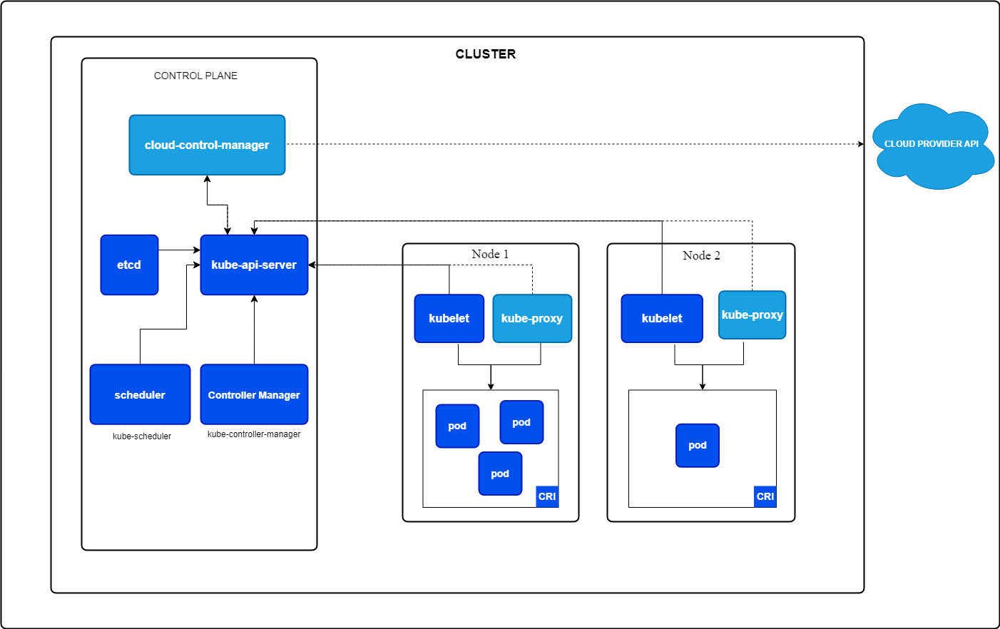

## Kubernetes Architecture

### Architecture Overview

### Kunbernetes Architecture Overview

- **Master Node**: The master node is responsible for managing the Kubernetes cluster. The master node common works including scheduling applications, maintaining applications' desired state, scaling applications, and rolling out new updates.
- **Worker Node**: The worker node is responsible for running the actual application instances. The worker node communicates with the master node to receive instructions and report back its status.

### Kubernetes Components

#### Master Components

- **kube-apiserver**: It is responsible foe communication between the master node components and the worker nodes. It exposes the Kubernetes API.
- **etcd**: Consistent and highly-available key value store used as Kubernetes' backing store for all cluster data.
- **kube-scheduler**: It will decide which node to run the pod on based on resource availability.
- **kube-controller-manager**: Runs controller processes such as Node Controller, Replication Controller, Endpoints Controller, and Service Account & Token Controllers.
- **cloud-controller-manager**: Runs controller processes that interact with the underlying cloud providers.

#### Node Components

- **kubelet**: An agent that runs on each node in the cluster. It communicate with the master node and manages the containers on the node as per the instructions provided by Kube Scheduler.
- **kube-proxy**: A network proxy that runs on each node in the cluster. It maintains network rules on nodes. These network rules allow network communication to the pods from network sessions inside or outside of the cluster. It allows Communication between the pods and containers from different worker nodes.

#### Communication Process in Kuberentes Architecture

- Normally the communication between each master node components and from master node to worker node is done through the kube-apiserver.
- Let's say if a user wants to create a pod, the user will send a request to the kube-apiserver.
    - The kube-apiserver will then communicate with the kube-scheduler to decide which node to run the pod on. 
    - The kube-scheduler will then communicate with the kube-apiserver to update it's decison on etcd.
    - The kube-apiserver will then communicate with the kubelet on the worker node to run the pod. 
    - The kubelet will then communicate with the container runtime to run the pod. When the pod is running, the kubelet will communicate with the kube-apiserver to update the status of the pod.
- In simple words, the `kube-apiserver` is the main component that is responsible for communication between the master node and the worker node.

Commit Date: 02/03/2024

